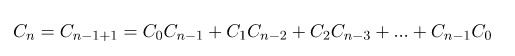
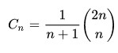
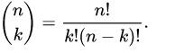
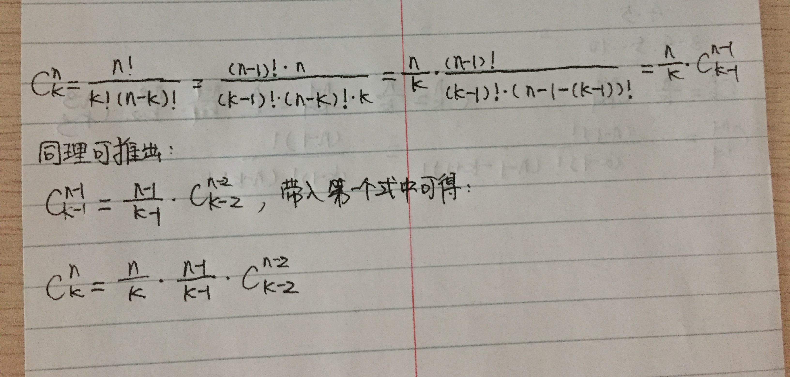
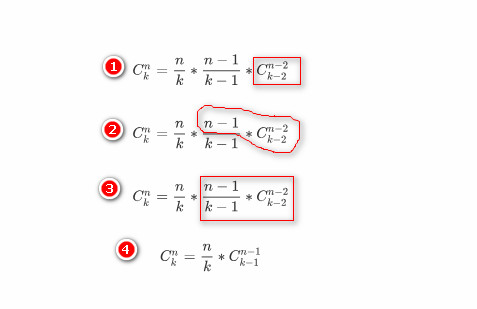
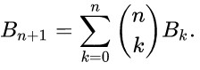

# 动态规划练习

学习动态规划我是从《Introduction to Algorithms》（[Thomas H.Cormen](https://book.douban.com/search/Thomas%20H.Cormen) / [Charles E.Leiserson](https://book.douban.com/search/Charles%20E.Leiserson) / [Ronald L.Rivest](https://book.douban.com/search/Ronald%20L.Rivest) / [Clifford Stein](https://book.douban.com/search/Clifford%20Stein) ，简称 CLRS 书）开始的，我把动态规划那章（第15章）前后看了两遍，也不敢说自己看懂了每句话，感觉对课后练习题还是一头雾水，也不知道自己对动态规划掌握到了哪种程度，所以开始刷题。下面是我刷题的记录，每道题我都尽量采用《Introduction to Algorithms》书里给出的解动态规划题的步骤来解题，未必都对，有错误的地方还请给我提出反馈，我及时改正。

《Introduction to Algorithms》里给出解动态规划题的4个步骤：

1. 刻画出问题的最优子结构。
2. 递归地定义最优解的值。
3. 用自底向上的方法计算出最优解的值。
4. 利用计算得到的信息构造最优解。

能应用动态规划算法的标志是：

1. 最优子结构。
2. 子问题重叠。

本文的每题按照下面的结构书写：

##### 第N题 题名

**题目**：.....

**解答**：

步骤一：刻画原问题的最优子结构。

步骤二：递归地定义最优解的值。

步骤三：采用从低向上的方法计算最优解的值。

步骤四：构造一个最优解。

题目来自 https://www.geeksforgeeks.org/dynamic-programming/ ，我自己先做题，做不出来结合它提供的答案理解后写在这里。

##### 第一题 Ugly number

**题目**：Ugly numbers are numbers whose only prime factors are 2, 3 or 5. The sequence 1, 2, 3, 4, 5, 6, 8, 9, 10, 12, 15, … shows the first 11 ugly numbers. By convention, 1 is included.

Given a number n, the task is to find n’th Ugly number.

Examples:

```c
Input  : n = 7
Output : 8

Input  : n = 10
Output : 12

Input  : n = 15
Output : 24

Input  : n = 150
Output : 5832
```

**解答：** 

步骤一：刻画原问题的最优子结构。

题目里给了 ugly number 的定义，即一个数仅有的质数因数是2,3,5. 一个 Ugly number 数可以写成

其中，x,y,z <- [0, +无穷)，即一个大的 Ugly number 必定由小的 Ugly number 乘以 2 或者 3 或者5 而来，所以可以把原问题划分成小的 Ugly number 乘以 2 或者 3 或者 5 的子问题来解决，原问题具有最优子结构。

步骤二：递归地定义最优解的值。

设 un(n) 表示第 n 个 ugly nubmer 的值，则.jpg)

其中，i2,i3,i5 是从 0 开始的下标，采用分治排序的思想，比对每个小 Ugly number 值分别乘以 2 、3 、5 后得到的大 Ugly number 值大小。

步骤三：采用从低向上的方法计算最优解的值。

代码如下所示：

```c
#include <stdio.h>
#include <stdlib.h>
#include <stdbool.h>

#define MIN(a, b) ((a < b)?a:b)

int ugly_number(int n) {
    // 刻画最优子结构
    // 递归定义最优解的值
    // 自底向上求解最优解的值
    // 利用计算的信息构造最优解
    /*
     * 如果一个数是 ugly number，那么它肯定是由比它小的 ugly number 乘以 2 or 3 or 5 得到，
     * 所以我们能以小的 ugly number 递推得到大的 ugly number
     *
     * 递归定义最优解的值
     * f(n) = 1 when n = 1
     * f(n) = min{ f(t2) * 2, f(t3) * 3, f(t5) * 5} when n >= 2
     * t2 t3 t5 的选择是分治排序的思想
     *
     */
    if (n < 1 || n > 150) {
        printf("input n=%d is illegal, 1 <= n <= 150.\n", n);
        return 0;
    }
    int un[150];
    un[0] = 1;

    int i2 = 0, i3 = 0, i5 = 0;
    int index;
    for (index = 1; index < n; ++index) {
        un[index] = MIN(un[i2] * 2, MIN(un[i3] * 3, un[i5] * 5));

        if (un[index] == un[i2] * 2) {
            ++i2;
        }

        if (un[index] == un[i3] * 3) {
            ++i3;
        }

        if (un[index] == un[i5] * 5) {
            ++i5;
        }
    }

    return un[n - 1];
}


int main() {
    int i = 11;
    printf("ugly number(%d): %d\n", i, ugly_number(i));
    return 0;
}
```

步骤四：构造一个最优解。

这道题的函数返回值就是最优解的值，无需额外利用存储空间记录信息来推导构造最优解的值。

##### 第二题 Fibonacci number

**题目**：The Fibonacci numbers are the numbers in the following integer sequence. 0, 1, 1, 2, 3, 5, 8, 13, 21, 34, 55, 89, 144, …….. In mathematical terms, the sequence Fn of Fibonacci numbers is defined by the recurrence relation Fn = Fn-1 + Fn-2，with seed values F0 = 0 and F1 = 1. Given a number n, print n-th Fibonacci Number.

Examples:

```c
Input  : n = 2
Output : 1

Input  : n = 9
Output : 34
```

**解答**：

步骤一：刻画出问题的最优子结构。

斐波那契数的定义指出了 n >= 2 的斐波那契数由前两个斐波那契数组成，我们计算出前两个斐波那契数就可以计算出第三个斐波那契数，本题具有最优子结构。

步骤二：递归地定义最优解的值。

从 Fibonacci 数的定义可以得到最优解的递归形式

fib(0) = 0,fib(1) = 1,fib(n) = fib(n-1) + fib(n-2)

步骤三：采用从低向上的方法计算最优解的值。

```c
int fib(int n) {
    int f[50];
    f[0] = 0;
    f[1] = 1;
    int i;
    for (i = 2; i <= n; ++i) {
        f[i] = f[i - 1] + f[i - 2];
    }
    return f[n];
}

int main() {
    int i = 10;
    printf("fib(%d): %d\n", i, fib(i));
    return 0;
}
```

步骤四：构造一个最优解。

步骤三中直接计算得到了最优解。

##### 第三题 Catalan number

**题目**：用动态规划求第 n 个 Catalan 数。

**解答**：

我不熟悉 Catalan 数，在维基百科上查了 [Catalan Number](https://en.wikipedia.org/wiki/Catalan_number) 的定义，不熟悉的人先看下定义。这里摘出关于 Catalan Number 重要的几点信息。

Catalan number 的通项公式如下：


也可以是：


Catalan 数有如下属性：


这个属性可以看出 Catalan 数具有递归性质，和第二题的 Fibonacci 数很像。

步骤一：刻画原问题的最优子结构。

根据 Catalan 数的性质可以看到，第 n 个 Catalan 数的子问题是前 n-1 个 Catalan 数。

步骤二：递归地定义最优解的值。

Catalan 数的属性即是一种最优解的递归定义。

步骤三：采用从低向上的方法计算最优解的值。

根据 Catalan 数属性公式可以得出第 n 个 Catalan 数是：



根据此公式可以写出代码：

```c
unsigned long int catalan_number(unsigned int n) {
    unsigned long int cn[30];
    // 根据最优解的递归定义可以算出 cn[1] 也是 1
    cn[0] = cn[1] = 1;
    unsigned int i;
    for (i = 2; i <= n; ++i) {
        cn[i] = 0;
        unsigned int j;
        for (j = 0; j < i; ++j) {
            cn[i] += (cn[j] * cn[i - 1 - j]);
        }
    }
    return cn[n];
}

int main() {
    int i = 9;
    printf("catalan_number(%d): %lu\n", i, catalan_number(i));
    return 0;
}
```

代码的核心是根据第 n 个 Catalan 数的递推公式得到的，递推公式和 Fibonacci 数不一样，但是思想是一模一样的。这道题根据第一个通项公式还有另一种解法，因为



我们可以直接计算第 n 个 Catalan 数。公式看似简单，仔细思考下会发现用直接的方式计算，在做阶乘是数据很容易上溢而出错。进而我们应该找如何更省空间的形式计算组合数。

代码如下：

```c
unsigned long int binomial2(unsigned int a, unsigned int b) {
    // C(n,0) = 1;
    unsigned long int ret = 1;

    // C(a,b) = C(a, a-b);
    if (b > a - b) {
        b = a - b;
    }

    unsigned int i;
    for (i = 1; i <= b; ++i) {
        ret *= (a - (b - i));
        ret /= i;
    }

    return ret;
}

unsigned long int catalan_number2(unsigned int n) {
    return binomial2(n * 2, n) / (n + 1);
}

int main() {
    int i = 10;
    printf("catalan_number(%d): %lu\n", i, catalan_number2(i));
    return 0;
}
```

这个代码之所以可行是因为有数学定理做理论支撑。看下面这个表达式，分子有 n 个数，分母 k + n - k  也有 n 个数，如果在分子中约去 k 的阶乘则分子还剩 n - k 个数，如果在分子中约去 n-k 阶乘则分子中还剩 k 个数，也就是不论约去分母中哪个因子，分子、分母数字个数是一样的(为循环提供了方便)。



再看一组这样的等式：



这里有个定理需要先说出来，即组合数（n >= 0, k >= 0）结果都是整数（待证明），所以上图中最后一行 (n-1) 乘以一个组合数得到的是整数，再除以 (k-1) 得到的是从 (n-1) 个实体中选 (k-1)个实体的组合数，故也是整数。这里可以看到自底向上动态规划算法的思想了。我们需要先算出小的组合数值，然后乘以 (n-i) 再除以 (k-i) 得到较大的组合数。注意需要先做乘法再做除法，如果顺序反了在公式里看不到影响，但是放在计算机里中间结果有可能是无尽的浮点数，计算机保存字段长度有限，再做乘法得到的值和正确答案就未必相同了。用图片表示计算顺序如下：



binomial2 的 for 循环里用 C(n,0) 做第一个子问题，第二个子问题是 C(n-(k-1),1)，第三个子问题是 C(n-(k-2), 2)，C(n,k) 中的 k 就表示了第几个子问题，循环里变量 i 从 1～k ，遍历了所有子问题。

步骤四：构造一个最优解。

步骤三中直接计算得到了最优解。

##### 第四题 Bell Number

**题目**：Given a set of n elements, find number of ways of partitioning it. Number of ways to Partition a Set.

Examples:

```c
Input:  n = 2
Output: Number of ways = 2
Explanation: Let the set be {1, 2}
            { {1}, {2} } 
            { {1, 2} }

Input:  n = 3
Output: Number of ways = 5
Explanation: Let the set be {1, 2, 3}
             { {1}, {2}, {3} }
             { {1}, {2, 3} }
             { {2}, {1, 3} }
             { {3}, {1, 2} }
             { {1, 2, 3} }. 
```

**解答**：

步骤一：刻画原问题的最优子结构。

Bell number 定义参考 wikipedia [内容](https://en.wikipedia.org/wiki/Bell_number)，表示分割集合的种数。例如：

```c
集合 {a, b, c} 有三个元素，分割这个集合有 5 中情况：
{ {a}, {b}, {c} }
{ {a}, {b, c} }
{ {b}, {a, c} }
{ {c}, {a, b} }
{ {a, b, c} }
所以，B(3) = 5。
```

B(0) = B(1) = 1，这类问题是专业问题，如果不是数学专业的同学估计很少会接触这个问题，如果我们从头推导 Bell Number 的规律耗时可能很久，也超出我的知识范围，怎么推也推不出来。我看了一遍 wikipedia 的介绍，简单了了解 Bell Number 概念。wikipedia 里直接给出了 Bell Number 数的递推公式，我们直接从这个递推公式入手。

步骤二：递归地定义最优解的值。

根据 wikipedia [内容](https://en.wikipedia.org/wiki/Bell_number#Properties)，得到递推公式如下：



做完上面几道题之后应该对这种递推公式有了直觉，适合用动态规划解。

步骤三：采用从低向上的方法计算最优解的值。

先手动计算下上图中的递推表达式：
$$
\begin{align*}
& B(n) = \sum_{k=0}^{n-1}\binom{n-1}{k}B(k),(n >= 2)
\\
& n = 2, B(2) = \sum_{k=0}^{1}\binom{1}{k}B(k)=\binom{1}{0}B(0) + \binom{1}{1}B(1)
\\
& n = 3, B(3) = \sum_{k=0}^{2}\binom{2}{k}B(k)=\binom{2}{0}B(0) + \binom{2}{1}B(1) + \binom{2}{2}B(2)
\\
& n = 4, B(4) = \sum_{k=0}^{3}\binom{3}{k}B(k)=\binom{3}{0}B(0) + \binom{3}{1}B(1) + \binom{3}{2}B(2) + \binom{3}{3}B(3)
\\
& ...
\end{align*}
$$


```c
unsigned long int binomial2(unsigned int a, unsigned int b) {
    // C(n,0) = 1;
    unsigned long int ret = 1;

    // C(a,b) = C(a, a-b);
    if (b > a - b) {
        b = a - b;
    }

    unsigned int i;
    for (i = 1; i <= b; ++i) {
        ret *= (a - (b - i));
        ret /= i;
    }

    return ret;
}

unsigned long int bell_number(int n) {
    int max = 11;
    if (n >= max) {
        printf("n great than max.");
        return 0;
    }
    unsigned long int bn[max];
    bn[0] = bn[1] = 1;
    if (n == 0 || n == 1) {
        return bn[n];
    }

    int i;
    for (i = 2; i <= n; ++i) {
        int j;
        bn[i] = 0;
        for (j = 0; j < i; ++j) {
            unsigned long int tmp = binomial2(i - 1, j);
            bn[i] += (tmp * bn[j]);
        }
    }

    return bn[n];
}

int main() {
    int i = 10;
    printf("bell_number(%d): %lu\n", i, bell_number(i));
    return 0;
}
```

从代码中可以看到复用了第三题的求组合数函数，那么这题使用递推表达式求解的话有两处用到了动态规划的思想，组合数里用到了，利用求解到的组合数计算 Bell Number 也用到了。

步骤四：构造一个最优解。

步骤三中直接计算得到了最优解。

上述的解法是一种解法，更好的解法是利用 Bell triangle 来解，读者可以自己扩展下。

**小总结**：做了上面几道题之后，我对动态规划算法有了基本的、简单的认识。Dynamic programming 的 programming 此处是**用表格记录**的意思，这个单词对动态规划算法的概括是点睛之笔。想到这里，我同时有个疑问，自底向上的动态规划算法是否可以看成"递归"的对立面？简单思考了一下，应该不是。递归没有用额外的空间，不管是自底向上还是自顶向下的动态规划都使用了额外的空间来保存信息，如果有对立感觉的话，自顶向下的动态规划和自底向上的动态规划才有对立的感觉。自顶向下的动态规划和递归很像，区别在自顶向下动态规划比递归多了额外的存储空间，使用空间换时间。

##### 第五题 Permutation Coefficient

**题目**：计算排列(n, k) 的值。

**解答**：

步骤一：刻画原问题的最优子结构。

高中时我们学过排列的计算公式：
$$
A^{n}_{k}=\frac{n!}{(n-k)!}\qquad
$$
不过我们不能直接使用这个公式来计算A(n, k)的排列值，因为分子分母是阶乘，稍大一点的数就会上溢。我们吸取上面解 binomial coefficient 题的经验，观察下面一组公式：
$$
\begin{align*}
& A^{n}_{k}=\frac{(n)!}{(n-k)!}=(n)\frac{(n-1)!}{(n-k)!}=nA^{n-1}_{k-1}\qquad 
\\
& A^{n-1}_{k-1}=\frac{(n-1)!}{(n-k)!}=(n-1)\frac{(n-2)!}{(n-k)!}=(n-1)A^{n-2}_{k-2}\qquad 
\\
& A^{n-2}_{k-2}=\frac{(n-2)!}{(n-k)!}=(n-2)\frac{(n-3)!}{(n-k)!}=(n-2)A^{n-3}_{k-3}\qquad 
\\
&...
\\
\\
& A^{n}_{k}=nA^{n-1}_{k-1}=n(n-1)A^{n-2}_{k-2}=n(n-1)(n-2)A^{n-3}_{k-3}
\end{align*}
$$
步骤二：递归地定义最优解的值。

从上面的公式组中就看到了最优解的递归定义如下：
$$
A^{n}_{k}=nA^{n-1}_{k-1}=n(n-1)A^{n-2}_{k-2}=n(n-1)(n-2)A^{n-3}_{k-3}
$$
步骤三：采用从低向上的方法计算最优解的值。

```c
#include <stdio.h>
#include <stdlib.h>

/**
 * 利用 DP 计算排列 A(n,k) 的值
 * */
unsigned long int permutation_coeffi(int n, int k)
{
    int i;
    if (n <= 0 || k < 0 || n < k)
    {
        printf("n <= 0 || k <= 0 || n < k, n: %d, d: %d\n", n, k);
        return 0;
    }

    // A(n, 0) = 1
    unsigned long int a = 1;
    for (i = 1; i <= k; ++i)
    {
        a *= (n - k + i);
    }
    return a;
}

void batch_permuta_coeffi()
{
    int n = 10;
    int i;
    for (i = 0; i <= 10; ++i)
    {
        printf("permutation_coeffi(%d, %d)=%lu\n", n, i, permutation_coeffi(n, i));
    }
}

int main()
{
    // int n = 10, k = 3;
    // printf("permutation_coeffi(%d, %d)=%lu\n", n, k, permutation_coeffi(n, k));
    batch_permuta_coeffi();
}
```

代码用自底向上的动态规划，在子问题规模 i = 1 开始，逐个求解到 i = k-1 的子问题，最后得到 A(n,k) 的值。

步骤四：构造一个最优解。

步骤三中直接计算得到了最优解。

##### 第六题 Tiling Problem

**题目**：.....

**解答**：

步骤一：刻画原问题的最优子结构。

步骤二：递归地定义最优解的值。

步骤三：采用从低向上的方法计算最优解的值。

步骤四：构造一个最优解。


第六题解答参考 https://journeywithdp.blogspot.com/2018/07/way-to-solve-tiling-problems.html