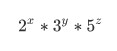

# 动态规划练习

学习动态规划我是从《Introduction to Algorithms》（[Thomas H.Cormen](https://book.douban.com/search/Thomas%20H.Cormen) / [Charles E.Leiserson](https://book.douban.com/search/Charles%20E.Leiserson) / [Ronald L.Rivest](https://book.douban.com/search/Ronald%20L.Rivest) / [Clifford Stein](https://book.douban.com/search/Clifford%20Stein) ，简称 CLRS 书）开始的，我把动态规划那章（第15章）前后看了两遍，也不敢说自己看懂了每句话，感觉对课后练习题还是一头雾水，也不知道自己对动态规划掌握到了哪种程度，所以开始刷题。下面是我刷题的记录，每道题我都尽量采用《Introduction to Algorithms》书里给出的解动态规划题的步骤来解题，未必都对，有错误的地方还请给我提出反馈，我及时改正。

《Introduction to Algorithms》里给出解动态规划题的4个步骤：

1. 刻画出问题的最优子结构。
2. 递归地定义最优解的值。
3. 用自底向上的方法计算出最优解的值。
4. 利用计算得到的信息构造最优解。

###### 第一题 Ugly number

**题目**：Ugly numbers are numbers whose only prime factors are 2, 3 or 5. The sequence 1, 2, 3, 4, 5, 6, 8, 9, 10, 12, 15, … shows the first 11 ugly numbers. By convention, 1 is included.

Given a number n, the task is to find n’th Ugly number.

Examples:

```c
Input  : n = 7
Output : 8

Input  : n = 10
Output : 12

Input  : n = 15
Output : 24

Input  : n = 150
Output : 5832
```

**解答：** 

步骤一：刻画原问题的最优子结构

题目里给了 ugly number 的定义，即一个数仅有的质数因数是2,3,5. 一个 Ugly number 数可以写成

其中，x,y,z <- [0, +无穷)，即一个大的 Ugly number 必定由小的 Ugly number 乘以 2 或者 3 或者5 而来，所以可以把原问题划分成小的 Ugly number 乘以 2 或者 3 或者 5 的子问题来解决，原问题具有最优子结构。

步骤二：递归地定义最优解的值

设 un(n) 表示第 n 个 ugly nubmer 的值，则.jpg)

其中，i2,i3,i5 是从 0 开始的下标，采用分治排序的思想，比对每个小 Ugly number 值分别乘以 2 、3 、5 后得到的大 Ugly number 值大小。

步骤三：采用从低向上的方法计算最优解的值。

代码如下所示：

```c
#include <stdio.h>
#include <stdlib.h>
#include <stdbool.h>

#define MIN(a, b) ((a < b)?a:b)

int ugly_number(int n) {
    // 刻画最优子结构
    // 递归定义最优解的值
    // 自底向上求解最优解的值
    // 利用计算的信息构造最优解
    /*
     * 如果一个数是 ugly number，那么它肯定是由比它小的 ugly number 乘以 2 or 3 or 5 得到，
     * 所以我们能以小的 ugly number 递推得到大的 ugly number
     *
     * 递归定义最优解的值
     * f(n) = 1 when n = 1
     * f(n) = min{ f(t2) * 2, f(t3) * 3, f(t5) * 5} when n >= 2
     * t2 t3 t5 的选择是分治排序的思想
     *
     */
    if (n < 1 || n > 150) {
        printf("input n=%d is illegal, 1 <= n <= 150.\n", n);
        return 0;
    }
    int un[150];
    un[0] = 1;

    int i2 = 0, i3 = 0, i5 = 0;
    int index;
    for (index = 1; index < n; ++index) {
        un[index] = MIN(un[i2] * 2, MIN(un[i3] * 3, un[i5] * 5));

        if (un[index] == un[i2] * 2) {
            ++i2;
        }

        if (un[index] == un[i3] * 3) {
            ++i3;
        }

        if (un[index] == un[i5] * 5) {
            ++i5;
        }
    }

    return un[n - 1];
}


int main() {
    int i = 11;
    printf("ugly number(%d): %d\n", i, ugly_number(i));
    return 0;
}
```

步骤四：构造一个最优解

这道题的函数返回值就是最优解的值，无需额外利用存储空间记录信息来推导构造最优解的值。