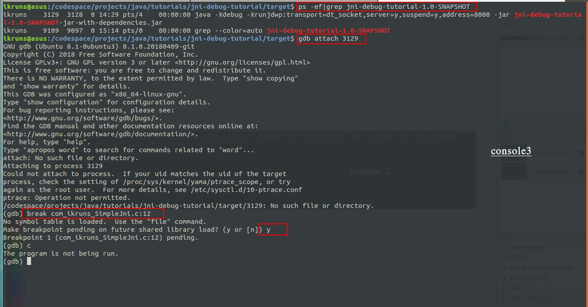

# 如何调试 JNI 代码

主要内容：

1. 用于演示用的代码
2. 调试

JNI 即 Java Native Interface，在 Java 代码中调用 C/C++ 库文件，JNI 代码和 Java 代码不是很像，和 C/C++ 代码倒挺相似。写完 JNI 代码后如何调试它，这个问题困扰了我一阵子，在网上搜索查找资料后，慢慢学会了如何调试它，在这里总结下。

## 用于演示的代码

这里不着重讲如何写 JNI 代码，我贴出我用来演示如何调试的代码。

Java 代码：

```java
package com.ikruns;

import org.slf4j.Logger;
import org.slf4j.LoggerFactory;

public class SimpleJni {
    private static final Logger LOGGER = LoggerFactory.getLogger(SimpleJni.class);

    static {
        // 使用 system.load 方法指定的是文件绝对路径
        // 实际项目中部署动态库的位置可能不同，为了避免写死动态库路径
        // 在启动脚本里增加一个环境变量，然后代码里读取环境变量值找到动态库即可
        String libHome = "LIB_HOME";
        String libName = "/libcaljni.so";

        String libPath = System.getenv(libHome) + libName;
        LOGGER.info("libPath is: {}", libPath);
        System.load(libPath);
    }

    public static void main(String[] args) {
        int a = 40, b = 90;
        int c = add(a, b);
        int d = sub(a, b);
        LOGGER.info("c: {}, d: {}", c, d);

    }

    public native static int add(int a, int b);

    public native static int sub(int a, int b);
}

```

bash  start.sh 启动脚本代码：

```bash
# LIB_HOME 用于 Java 代码找到需要加载的动态库 libcaljni.so 的路径
export LIB_HOME="/codespace/projects/java/tutorials/c-code-jni-debug-tutorial"
# LD_LIBRARY_PATH 动态库加载的搜索路径，libcaljni 动态库根据此路径找到 libcal 动态库
export export LD_LIBRARY_PATH=$LD_LIBRARY_PATH:/codespace/projects/java/tutorials/c-code-jni-debug-tutorial

# 此处是以 debug 的方式启动 jar 包，这也是后面能 debug jni 代码的基础 
# 中间几个字段的含义可以自己在官网文档中查找
java -Xdebug -Xrunjdwp:transport=dt_socket,server=y,suspend=y,address=8000 -jar jni-debug-tutorial-1.0-SNAPSHOT-jar-with-dependencies.jar
```

演示样例的 C 代码头文件：

```c
#ifndef __CALCULATE_H__
#define __CALCULATE_H__

int add(int a, int b);

int sub(int a, int b);

#endif
```

演示样例的 C 代码：

```c
#include <stdlib.h>
#include <stdio.h>
#include "calculate.h"

int add(int a, int b)
{
    int c = a + b;
    printf("a + b = %d\n", c);
    return c;
}

int sub(int a, int b)
{
    int c = a - b;
    printf("a - b = %d\n", c);
    return c;
}
```

为了能在 Java 中使用 C 代码，需要把 C 代码打包成动态链接库，makefile 代码如下：

```makefile
CXX=gcc -g
CFLAGS=
LIBS=

SRC= calculate.c 
OBJ= libcal.so

$(OBJ): calculate.o
	$(CXX) -shared -o -fPIC -o $@ $^

calculate.o:$(SRC)
	$(CXX) -c -fPIC $^ -o $@

.PHONY:clean

clean:
	-rm -rf $(OBJ) calculate.o

```

上面已经把 Java 代码和 C 代码准备好了，还缺少 JNI 代码。

JNI 代码由两部分组成：

1. Java 的 native 代码，是纯 Java 代码。
2. 类 C/C++ 的 JNI 代码。

写第二部分需要由第一部分生成一个 C 头文件，如何根据 Java native 代码得到头文件网上有不少教程，我不细述，我贴出我参考的教程链接，https://blog.csdn.net/huachao1001/article/details/53906237 。如果使用 intellij idea 做开发工具，按照里面的几张图操作很容易得到 写 JNI 代码的头文件。如下：


生成的 JNI C 头文件代码：

```c
/* DO NOT EDIT THIS FILE - it is machine generated */
#include <jni.h>
/* Header for class com_ikruns_SimpleJni */

#ifndef _Included_com_ikruns_SimpleJni
#define _Included_com_ikruns_SimpleJni
#ifdef __cplusplus
extern "C" {
#endif
/*
 * Class:     com_ikruns_SimpleJni
 * Method:    add
 * Signature: (II)I
 */
JNIEXPORT jint JNICALL Java_com_ikruns_SimpleJni_add
  (JNIEnv *, jclass, jint, jint);

/*
 * Class:     com_ikruns_SimpleJni
 * Method:    sub
 * Signature: (II)I
 */
JNIEXPORT jint JNICALL Java_com_ikruns_SimpleJni_sub
  (JNIEnv *, jclass, jint, jint);

#ifdef __cplusplus
}
#endif
#endif

```

有了 C 头文件可以写 JNI 代码的实现了：

```c
#include "com_ikruns_SimpleJni.h"
#include <jni.h>
#include "calculate.h"

/*
 * Class:     com_ikruns_SimpleJni
 * Method:    add
 * Signature: (II)I
 */
JNIEXPORT jint JNICALL Java_com_ikruns_SimpleJni_add
  (JNIEnv *env, jclass jclazz, jint a, jint b){
      return add(a, b);
  }

/*
 * Class:     com_ikruns_SimpleJni
 * Method:    sub
 * Signature: (II)I
 */
JNIEXPORT jint JNICALL Java_com_ikruns_SimpleJni_sub
  (JNIEnv *env, jclass jclazz, jint a, jint b){
      return sub(a, b);
  }
```

现在需要把 JNI 代码的第二部分，即 C/C++ 部分代码 build 成动态链接库，makefile 如下：

```makefile
CXX=gcc -g
INCLUDE=-I /usr/java/jdk1.8.0_221/include -I /usr/java/jdk1.8.0_221/include/linux
CFLAGS= -L.
WERROR= -Werror
LIBS=-lcal

SRC=com_ikruns_SimpleJni.c
OBJ=libcaljni.so

$(OBJ):$(SRC)
	$(CXX) $(WERROR) -shared -fPIC $(INCLUDE) $(CFLAGS) -o $@ $^ $(LIBS)

.PHONY:clean

clean:
	-rm -rf $(OBJ)

```

好了，现在含有 JNI 代码的工程前后已经准备好了。开始调试 JNI 代码。

## 调试

调试功能需要借助2个工具，jdb 和 gdb，jdb 常用调试 Java 进程，gdb 常用于调试  Ada, C, C++, Objective-C, Free Pascal, Fortran, Go 等语言进程。

###### 步骤一：debug 方式启动 Java 进程 main 方法。

把 Java 代码打包成 Jar 文件，然后以 debug 的方式启动，如上面的 bash start.sh 脚本内容写的，重点是这行代码：

```bash
java -Xdebug -Xrunjdwp:transport=dt_socket,server=y,suspend=y,address=8000 -jar jni-debug-tutorial-1.0-SNAPSHOT-jar-with-dependencies.jar
```

执行 `sh start.sh` 后控制台会卡住，如下图：


###### 步骤二：使用 jdb 调试 Java 进程。

现在需要打开第二个控制台，输入：

```bash
jdb -attach 127.0.0.1:8080
```

此时第二和控制台也会卡住，如图：


此时 jdb 已经 attach 到使用 start.sh 脚本启动的 Java 进程中，代码还未接着往下走，需要输入 `run` 让代码继续往下走，不过不着急，我们先启动 gdb 并 attach 到 start.sh 启动的 Java 进程中，如：

###### 步骤三：使用 gdb 贴上 Java 进程。

```bash
gdb attach PID
```



上图中，先用 ps 指令找到启动的 Java 进程，然后利用 `gdb attach PID` 指令 attach 到 Java 进程。趁进程还没真正跑代码，先在 com_ikruns_SimapleJni.c （这个文件是我演示使用到的代码，对应的是 JNI 的C/C++代码部分）文件设置了一个断点，设置好断点后开始 run Java 进程。

###### 步骤四：用 jdb 控制运行 Java 程序

在 console2 输入 `run`，如下图：


因为演示代码是直接调用的 nativie code，刚才又在 com_ikruns_SimpleJni.c 文件里设置了断点，此时代码卡住是因为控制流程已经交给 gdb 了，我们看下 gdb 控制台窗口：

###### 步骤五：gdb 接管并控制进程，开始调试


先按下c键，gdb 中 continue 的缩写，接着就提示命中断点，并停在了断点处。

到此处就已经由 gdb 接管 Java 进程了，不过 gdb 只能接管 Java 进程中它能接管的部分，纯 Java 代码的调试它接管不了。后面的调试和使用 gdb 调试 C/C++ 代码一样，C/C++ 代码加 -g 编译后能在 gdb 中看到源码，我们进入 add 函数体里看看。在 console3 gdb 里按下 layout src 回车，看到界面变成：


这是用 gdb 查看源码模式，接着再按下 s 进入函数体：


现在由 JNI 代码的 C/C++ 部分完全进入 C/C++ 语言实现的动态库代码里了。后面的调试和调试C/C++代码完全一样。C/C++代码走完后控制流程还是会交到 jdb 手里，可以继续控制 java 的调试，直到调试完成。

## 总结

调试JNI代码就是由 jdb 启动和调试 java 代码部分，然后把控制交给 gdb 调试 C/C++ 代码部分，gdb 调试完之后控制流再还给 jdb。主要记住用 `java -Xdebug -Xrunjdwp:transport=dt_socket,server=y,suspend=y,address=8000 -jar` 启动 Java 进程，再用 `jdb -attach 127.0.0.1:8000` 让 jdb 贴到启动的 Java 的进程中，最后用 `gdb attache PID` 贴到启动的 Java 进程中，在 JNI 代码里加上断点，当运行到 JNI 代码部分 gdb 会接管控制进程，进行调试即可。